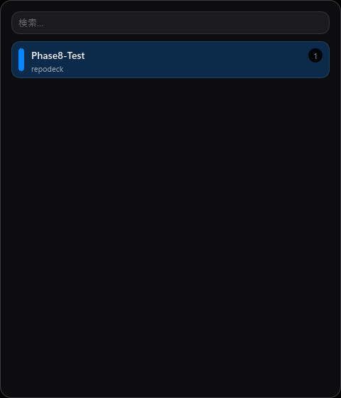
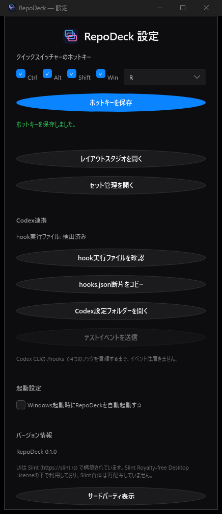
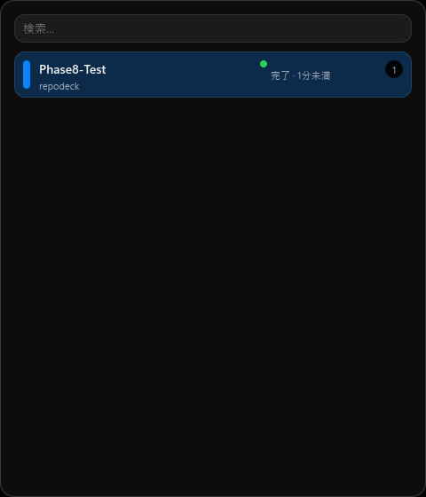

# RepoDeck

[日本語 README](README.md)

RepoDeck is a Windows desktop app that manages the window layout of multiple
repositories/projects as "worksets," letting you switch between them instantly
with a global hotkey and a Quick Switcher. It integrates with Codex CLI / VS
Code extension lifecycle hooks to show each workset's Codex agent status
(running, needs input, ready) as a badge and tray-icon color.

- Built with Rust + [Slint](https://slint.rs), native Windows (no C#/WPF)
- Fully local: no network calls, no telemetry
- No installer required — just run `repodeck.exe`

## Install

1. Download `RepoDeck-v<version>-windows-x64.zip` from
   [Releases](https://github.com/zappyzed100/repodeck/releases)
2. Extract it anywhere (no admin rights, no installer needed)
3. Run `repodeck.exe` — it stays resident as a tray icon

## Try it in 30 seconds

1. Launch `repodeck.exe` (a tray icon appears)
2. Right-click the tray icon → "新しいセットを登録" (Register a new workset) to
   register the folder/windows you currently have open as a workset
3. Register a second workset the same way, from a different folder
4. Press `Ctrl+Alt+R` (the default hotkey) to open the Quick Switcher
5. Both registered worksets are listed — click one, or press a number key
   (`1`, `2`, ...) to switch. The windows of whichever workset isn't selected
   are automatically parked (minimized or moved to a reserved slot)

## Usage

### Registering a workset

Open the workset manager from the tray menu's "新しいセットを登録" (Register a
new workset), or from the Quick Switcher's "セット管理を開く" (Open workset
manager), and pick a folder. If a `.git` directory is found by walking up from
that folder, its root is registered as the repository; otherwise the picked
folder itself is registered as a plain directory. Check the currently-open
windows you want to include, then save — their placement (position, size,
maximized state) is captured.

### Quick Switcher

- Default hotkey: `Ctrl+Alt+R` (changeable in Settings)
- Toggle visibility with the hotkey or a left-click on the tray icon
- Type to filter by workset name or repository path
- Up/Down + Enter, number keys (`1`-`9`) for direct switching, or click a row
- Esc closes it; it can also be set to close automatically on focus loss

### Settings window

Open it from the tray menu's "設定" (Settings).

- **Hotkey**: pick modifier keys (Ctrl/Alt/Shift/Win) and a key, then save. If
  it conflicts with another app, RepoDeck automatically rolls back to the
  previous hotkey and tells you so
- **Codex連携** (Codex integration): see below
- **起動設定** (Startup): toggle whether RepoDeck starts automatically with
  Windows
- **バージョン情報** (About): version number and third-party license notices

### Setting up Codex integration

RepoDeck never launches or connects to Codex itself. Instead, the bundled
`repodeck-hook.exe` is registered as the target of Codex CLI's / the VS Code
extension's own lifecycle hooks, so RepoDeck can reflect each workset's Codex
activity as a Quick Switcher badge and tray-icon color (running = blue, needs
input = yellow, ready = green).

In the Settings window's "Codex連携" section:

1. "hook実行ファイルを確認" (Check hook executable) — confirms
   `repodeck-hook.exe` sits next to `repodeck.exe`
2. "hooks.json断片をコピー" (Copy hooks.json snippet) — copies the config
   fragment to your clipboard
3. Paste it into Codex's own `hooks.json` (open its config folder via
   "Codex設定フォルダーを開く")
4. Run `/hooks` in Codex CLI and review/trust the 4 added hooks
5. Restart Codex, or reload its configuration
6. "テストイベントを送信" (Send test event) to verify the pipeline end-to-end
   (requires at least one registered workset)

**Note**: no events arrive until you've trusted all 4 hooks via Codex CLI's
`/hooks`.

### Recovering windows

- Tray menu "全管理ウィンドウを回収" (Recover all windows): an emergency action
  that forcibly gathers every registered window onto the main screen
- If RepoDeck crashes mid-switch, the next launch shows a "previous switch was
  interrupted" dialog offering to restore the original layout, recover
  everything to the main screen, or do nothing
- Windows left offscreen by a monitor configuration change (e.g. a
  disconnected display) are automatically minimized

## Known limitations (MVP)

- Windows only. Does not use Windows virtual desktops
- Windows launched elevated (as administrator) are refused, by design (a
  security boundary)
- Windows toast notifications, automatic `hooks.json` editing, a signed
  installer, and auto-update are not yet implemented (planned for a future
  version)

## License

RepoDeck itself is MIT-licensed (see [LICENSE](LICENSE)). Its UI is built with
[Slint](https://slint.rs), used under the Slint Royalty-free Desktop License.
See [THIRD_PARTY_NOTICES.md](THIRD_PARTY_NOTICES.md) for the full list of
third-party dependencies and licenses.
